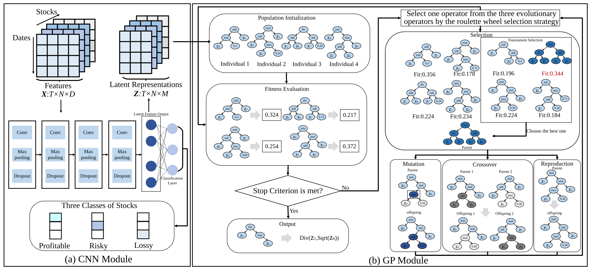
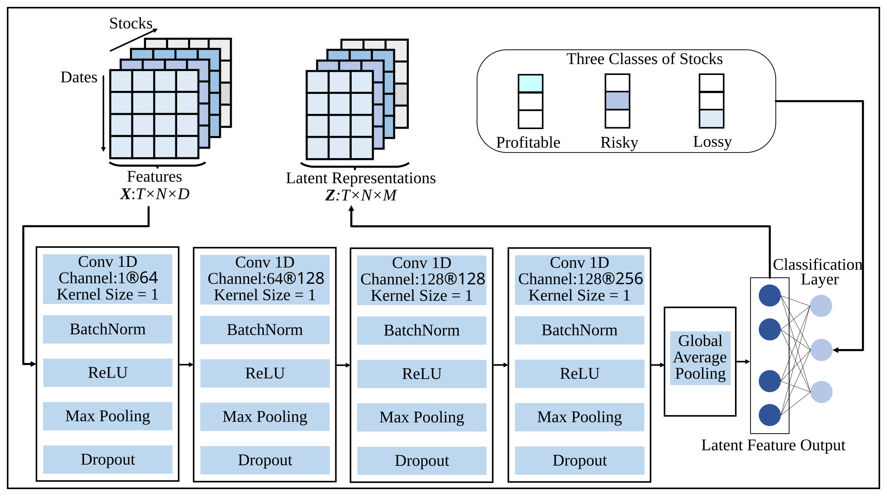

# CNN-GP: Alpha Factor Mining via Representation Learning and Genetic Programming

This repository provides the source code, datasets, and supplementary material for **CNN-GP**, a coarse-to-fine framework for alpha factor mining.

CNN-GP integrates **representation learning** and **symbolic mining** into a unified framework. A Convolutional Neural Network (CNN) first transforms the original high-dimensional stock features into a compact latent representation. Genetic Programming (GP) subsequently searches over the learned latent features to generate explicit symbolic alpha factors.

The experiments are conducted on two real-world stock market datasets, **CSI500** and **CSI1000**.

---

## Repository Structure

```text
CNN-GP/
│
├── #430-CNN-GP Supplementary Material.pdf
├── GP-CNN.py
├── SCI500_code.xlsx
├── SCI1000_code.xlsx
├── factor_eval.py
├── README.md
│
└── figures/
    ├── cnn_gp_framework.svg
    └── cnn_architecture.svg
```

---

## Method Overview

CNN-GP follows a **coarse-to-fine alpha factor mining paradigm**, in which representation learning and symbolic mining are organically integrated.

<p align="center">
  
</p>

<p align="center">
  <b>Figure 1. Overall framework of CNN-GP.</b>
</p>

The overall procedure consists of three main stages:

### 1. Representation Learning

The CNN performs feature-oriented representation learning on the original high-dimensional stock features and transforms them into a compact latent representation.

Instead of directly performing symbolic search over the raw feature space, CNN-GP provides GP with a lower-dimensional and task-oriented search space.

### 2. Symbolic Alpha Factor Mining

GP performs symbolic search over the learned latent features and generates explicit mathematical expressions as predictive alpha factors.

This design combines the representation capability of CNN with the structural transparency of GP-based symbolic expressions.

### 3. Factor Evaluation

The generated alpha factors are evaluated on the CSI500 and CSI1000 datasets using **RankIC** and **ALER**.

---

## CNN Module

The CNN component performs **feature-oriented representation learning** rather than explicitly modeling dependencies across consecutive trading dates.

Its architecture is illustrated below.

<p align="center">
  
</p>

<p align="center">
  <b>Figure 2. CNN module architecture for latent feature extraction.</b>
</p>

The CNN contains four Conv1D blocks with the following channel configurations:

```text
1 → 64 → 128 → 128 → 256
```

The kernel size of all four convolutional blocks is **1**.

Each block is followed by:

```text
Batch Normalization
ReLU
Max Pooling
Dropout
```

After the four convolutional blocks, Global Average Pooling is used to obtain a 256-dimensional representation. An additional 1-by-1 Conv1D projection is then applied to obtain the final \(M\)-dimensional latent representation.

The CNN does not explicitly model dependencies across consecutive dates. Instead, it focuses on extracting and compressing informative patterns across the raw features within each trading day.

In the experiments reported in the paper, the number of latent features is set to:

```text
M = 10
```

based on the parameter sensitivity analysis.

---

## File Description

### `GP-CNN.py`

Main implementation of the proposed CNN-GP framework, including:

- CNN-based latent feature extraction;
- GP-based symbolic alpha factor mining;
- generation of predictive symbolic alpha expressions.

### `SCI500_code.xlsx`

Experimental data associated with the CSI500 dataset.

### `SCI1000_code.xlsx`

Experimental data associated with the CSI1000 dataset.

### `factor_eval.py`

Evaluation code for the generated alpha factors, including the calculation of the main evaluation metrics used in the experiments.

### `#430-CNN-GP Supplementary Material.pdf`

Supplementary material containing additional methodological and experimental details, including:

- CNN architecture and processing procedure;
- statistical significance analysis;
- runtime comparison;
- parameter sensitivity analysis;
- additional experimental results.

### `figures/`

Contains the figures used to illustrate the CNN-GP framework and CNN architecture:

- `cnn_gp_framework.svg`: overall framework of CNN-GP;
- `cnn_architecture.svg`: architecture of the CNN module.

---

## Evaluation Metrics

The main evaluation metrics used in the experiments are **RankIC** and **ALER**.

### RankIC

For each trading day, RankIC is calculated as the cross-sectional Spearman correlation between the predicted factor values of all evaluated stocks and their one-day forward returns.

The daily RankIC values are then averaged over the entire test period to evaluate each algorithm.

### ALER

For each trading day, all evaluated stocks are ranked according to their predicted factor values.

The top 10% of stocks are equally weighted to construct the long portfolio.

The daily excess return is calculated as the return of the long portfolio minus the equal-weighted return of all evaluated stocks on the same trading day.

These daily excess returns are subsequently compounded over the entire test period and annualized to obtain **ALER**.

---

## Running the Code

The main implementation of CNN-GP is provided in:

```text
GP-CNN.py
```

The factor evaluation procedure is provided in:

```text
factor_eval.py
```

Before running the experiments, please ensure that the required Python packages and the corresponding CSI500/CSI1000 data files are available.

Because file paths and computational environments may differ across systems, the relevant data paths should be adjusted according to the local environment before execution.

---

## Reproducibility

This repository provides the materials required to reproduce and examine the main experiments reported in the paper, including:

- CNN-GP source code;
- CSI500 experimental data;
- CSI1000 experimental data;
- alpha factor evaluation code;
- CNN architecture;
- statistical significance analysis;
- runtime analysis;
- parameter sensitivity analysis;
- supplementary experimental results.

For complete experimental settings and additional results, please refer to:

```text
#430-CNN-GP Supplementary Material.pdf
```

---

## Data Availability

The source code, datasets, and supplementary materials are publicly available in this repository:

https://github.com/202412491495/CNN-GP

---

## Notes

This repository is provided for academic research and reproducibility purposes.

For detailed descriptions of the CNN-GP framework, experimental settings, evaluation protocol, and additional analyses, please refer to the paper and the supplementary material.
